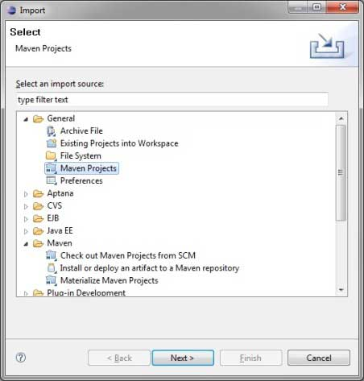
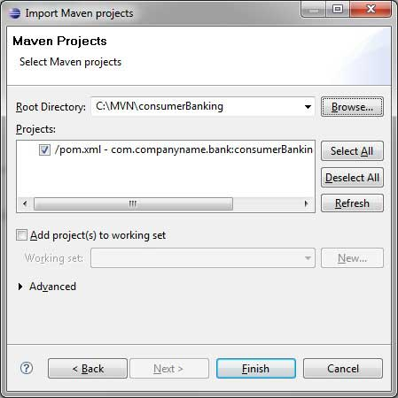
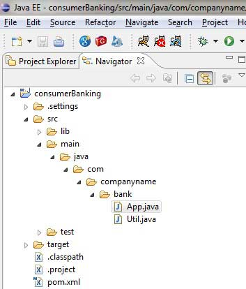
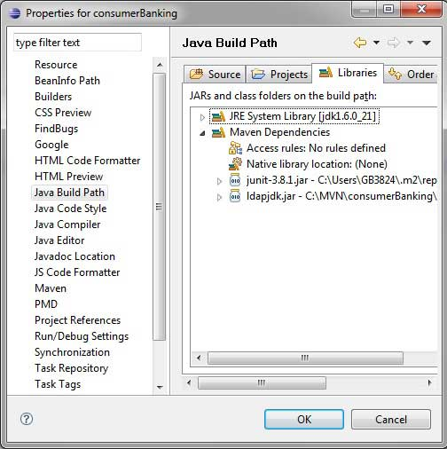
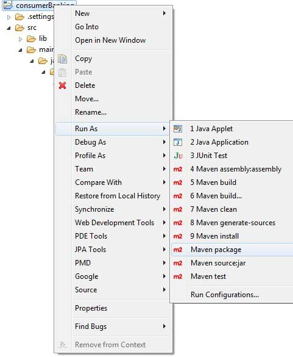

#<center> Elipse IDE

Eclipse 提供一种卓越的插件 [**m2eclipse**](http://www.eclipse.org/m2e/)，该插件使得Maven和Eclipse能够无缝集成。
下面列出 m2eclipse 的一些特点：

- 可以在 Eclipse 环境上运行 Maven 的目标文件；
- 可以使用其自带的控制台在 Eclipse 中直接查看 Maven 命令的输出；
- 可以在 IDE 下更新 Maven 的依赖关系；
- 可以使用 Eclipse 开展 Maven 工程的构建；
- Eclipse 基于 Maven 的 pom.xml 来实现自动化管理依赖关系；
- 它解决了 Maven 与 Eclipse 的工作空间之间的依赖，而不需要安装到本地 Maven 的存储库（需要依赖项目在同一个工作区）；
- 它可以自动地从远端的 Maven 库中下载所需要的依赖以及源码；
- 它提供了向导，为建立新 Maven 工程，pom.xml 以及在已有的工程上开启 Maven 支持；
- 它提供了远端的 Maven 存储库的依赖的快速搜索。

## 安装 m2eclipse 插件
使用以下任意一个链接来安装 m2eclipse:

|Eclipse	        |URL          |
|----------------|------------|
|Eclipse 3.5 (Gallileo)	| [Installing m2eclipse in Eclipse 3.5 (Gallileo)](http://books.sonatype.com/m2eclipse-book/reference/ch02s03.html)|
|Eclipse 3.6 (Helios)| [Installing m2eclipse in Eclipse 3.6 (Helios)](http://books.sonatype.com/m2eclipse-book/reference/install-sect-marketplace.html)|

以下的示例可以帮助你有效地利用集成 Eclipse 和 Maven.

## 在 Eclipse 中导入一个 Maven 的工程

- 打开 Eclipse.
- 选择 **File > Import** > option.
- 选择 Maven Projects 选项。点击 Next 按钮。

<center>

</center>

- 选择工程的路径，即使用 Maven 创建一个工程时的存储路径。假设我们创建了一个工程： consumerBanking. 通过 [**Maven - 创建工程**](maven-9-creating-project.md) 查看如何使用 Maven 创建一个工程。
- 点击 Finish 按钮。

<center>

</center>

现在，你可以在 Eclipse 中看到 Maven 工程。

<center>

</center>

看一下 consumerBanking 工程的属性，你可以发现 Eclipse 已经将 Maven 所依赖的都添加到了它的构建路径里了。

<center>

</center>

好了，我们来使用 Eclipse 的编译功能来构建这个 Maven 工程。

- 右键打开 consumerBanking 项目的上下文菜单；
- 选择 Run 选项；
- 然后选择 maven package 选项。

Maven 开始构建工程，你可以在 Eclispe 的控制台看到输出日志。

```
[INFO] Scanning for projects...
[INFO] -------------------------------------------------------------------
[INFO] Building consumerBanking
[INFO] 
[INFO] Id: com.companyname.bank:consumerBanking:jar:1.0-SNAPSHOT
[INFO] task-segment: [package]
[INFO] -------------------------------------------------------------------
[INFO] [resources:resources]
[INFO] Using default encoding to copy filtered resources.
[INFO] [compiler:compile]
[INFO] Nothing to compile - all classes are up to date
[INFO] [resources:testResources]
[INFO] Using default encoding to copy filtered resources.
[INFO] [compiler:testCompile]
[INFO] Nothing to compile - all classes are up to date
[INFO] [surefire:test]
[INFO] Surefire report directory: 
C:\MVN\consumerBanking\target\surefire-reports

-------------------------------------------------------
 T E S T S
-------------------------------------------------------
Running com.companyname.bank.AppTest
Tests run: 1, Failures: 0, Errors: 0, Skipped: 0, Time elapsed: 0.047 sec

Results :

Tests run: 1, Failures: 0, Errors: 0, Skipped: 0

[INFO] [jar:jar]
[INFO] -------------------------------------------------------------------
[INFO] BUILD SUCCESSFUL
[INFO] -------------------------------------------------------------------
[INFO] Total time: 1 second
[INFO] Finished at: Thu Jul 12 18:18:24 IST 2012
[INFO] Final Memory: 2M/15M
[INFO] -------------------------------------------------------------------
```

<center>

</center>

现在，右键点击 App.java. 选择 Run As 选项。选择 As Java App.

你将看到如下结果：

```
Hello World!
```